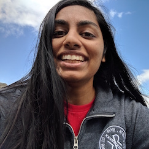

##### BS Computer Science, Georgia Tech `December 2019`
##### Interested in `full-time/new grad roles`

I'm particularly intruiged by work in transportation optimization, productivity, and financial openness. 

I derive excitement from working on products that have tangible impacts on the quality of people's lives, enabling them to focus their time on the more important interactions. 

I also enjoy tackling technical problems bounded by the constraints of a system, and enabling processes to scale and function without a hitch.

###### Contact

Find me on **[LinkedIn](https://www.linkedin.com/in/vishwa35/)** or email me at **vishwashah [at] gatech [dot] edu**.

###### What Else Do I Do?

`Hiking` `Photography` `Investing`

