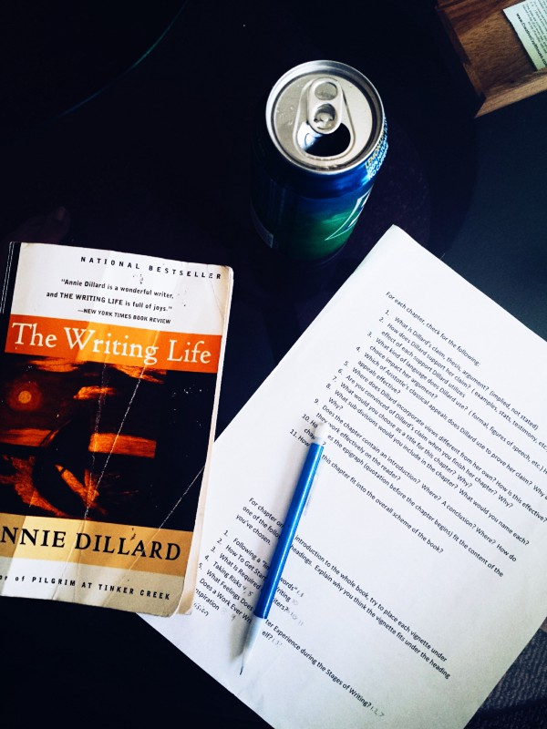

Find me on Instagram @postcardsfromvish

### I skipped homework to spend time on things I wanted to do.

#### And I don’t regret it at all.

Easter 2015. (Even though I don’t celebrate Easter.)

A little bit about me, to give you some background: I’m a junior in high school who enjoys taking Calc, Physics, and Chem; generally detests English class for the difficulties it presents; and has recently found the arts (including photography, and more recently, writing) to be non-contradictory to “math-y” subjects and surprisingly interesting.

A 3-day weekend is a time to catch up. Take practice ACT tests, finish ongoing projects, complete all the little tasks accumulated over the past few weeks.

Since I don’t celebrate Good Friday/Easter, it really was a 3-day weekend. Yet I hardly did any school-related work at all.

On Friday, I slept in a little. I woke up and checked my phone, like I routinely do. It’s a bad habit, probably, but I can’t seem to resist the urge. (I don’t really get that many messages or notifications, but I suppose I’m excited to see what I did receive while I was asleep? Maybe I’ll do an experiment in which I check my phone only after I shower.) That consumes the first ten or so minutes after I wake up. I finally got out of bed and turned on my laptop.

I read a [Lifehacker article I found on Twitter,] (http://lifehacker.com/things-you-should-never-say-to-women-working-in-tech-or-1695257473)and then saw it linked to a Medium post. I read it.

It was good — about female stereotypes in tech careers.

[Coding Like a Girl](https://medium.com/p/595b90791cce)

For some reason, then, I was inspired to make a Medium account. It was as easy as signing in with Twitter, so I followed the whim. Unknowingly, I opened the doors of an entirely new world.

Less than six months ago, I did the same with Tumblr. It isn&#39;t as intellectual as the content on Medium, generally speaking. I use it for my [photography portfolio.](http://vshahphoto.tumblr.com)

Medium is a different animal. Its simplicity allured me (I&#39;ve always liked minimalist design) and drew me in. I read through Medium’s tutorial/FAQ style posts and got acquainted with how things worked.

I read, for a while. At this point in the day, I still hadn&#39;t left my room (or brushed my teeth.) I started a WordPress blog sometime in late 2014, but it was difficult to keep writing on it without any feedback; hardly anyone read it, and if they did, they didn&#39;t interact with the content. It wasn&#39;t easy for me to interact with others’ content either. On Medium, comments, recommendations, and time estimations give me a lot more freedom to express and read content that interests me.

So I imported something I previously wrote on WordPress into Medium, refined my writing, and [published it.](https://medium.com/@vishifishy/how-to-fix-the-teacher-auditing-conundrum-216b400fe7c7) Hesitant to Tweet about it, I just tagged it and let it run its course.

Meanwhile, I kept reading other people’s stories. The variety of articles present on this medium (haha punny, right?) surprised me. Travel, personal stories, news commentary, music, film, tech, education. Finally, I stumbled upon a publication (and actually recognized it for being something other than a single writer.) [Get Absurdist.](https://medium.com/get-absurdist) I thought, hmm, perhaps if I could get someone to read this for me and see if it’s good — even worth a publication?

I tweeted @GetAbsurdist, and its Editor, @YungRama.

> 

And then this happened:

> 

And soon after that:

> 

I was justifiably excited, since pretty much the first thing I wrote for non-academic reasons was actually decent and would find some small audience easily. ([The Synapse](http://medium.com/synapse) had over 10K followers at the time of this writing.)

Anyway, while the tweet conversation occurred, I finished my morning routine. I did a little bit of practice ACT. I ate lunch with my family, and hung out downstairs.

Later, after some communication, Shawn emailed me and invited me to become the “official photographer” of The Synapse. I am extremely grateful to him for extending this offer to me; there really is no need for one given the tons of stock images available for public use. I was pleasantly surprised and accepted the opportunity.

So instead of doing my English homework, which is to read Annie Dillard’s _The Writing Life_, I started my own writing life. (I high-fived myself for making this pun, but I think that the non-fiction work legitimately may have been a subconscious motivation for me to start writing.) I also didn&#39;t really accomplish much in terms of measured schoolwork. No significant ACT practice, AP exam studying, violin practice, or extracurricular activity.

That night, I finished writing and published my second piece, a response to a writing prompt, which talks about my love for photography:

[I take photos.](https://medium.com/p/64c153317cda)m

The most surprising part of this entire writing thing was my courage and willingness to publish it online — knowing it will live more or less indefinitely. Evidently, it was a good Friday.

Saturday and Sunday I mostly spent either reading other people’s stories on Medium or working on drafts for my future stories. I relaxed quite a bit on Saturday, getting some work done between breaks.

Sunday, I celebrated a religious festival (not Easter) which coincidentally landed in the same week. My temple celebrates the festival on the weekend for convenience. I finished up my homework while simultaneously checking Medium for any updates from Shawn.

The story was finally added to The Synapse on Monday morning. I was pleasantly surprised by the notifications I received (typical teenager reaction) and I hope the rest of the time I spend writing/on Medium is as exciting as the beginning.

#### Welcome to MY writing life.

Hopefully I’m here to stay.

_Special Thanks to Vikram Babu (@YungRama, a pretty cool Twitter handle to have, right?) and Shawn White (@swpax) for motivating me to write on Medium, and in addition to read. Also for complimenting my photography — positive feedback every once in a while really keeps me going!_
