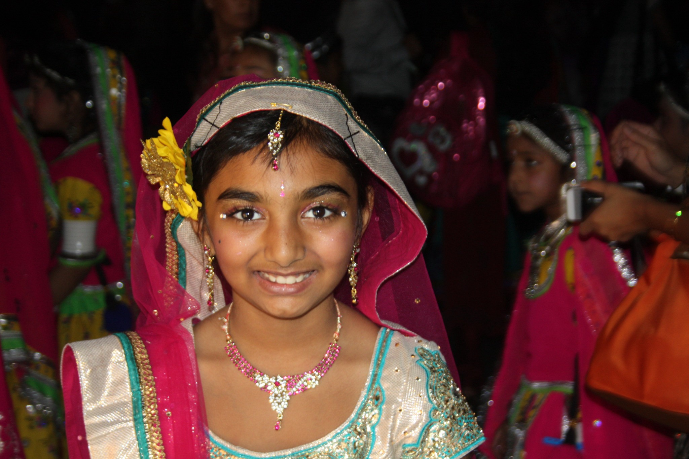
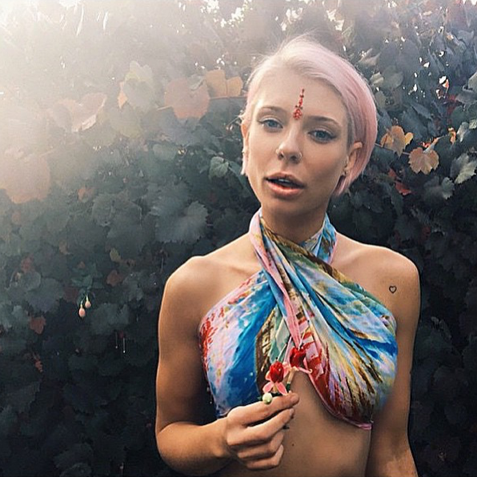
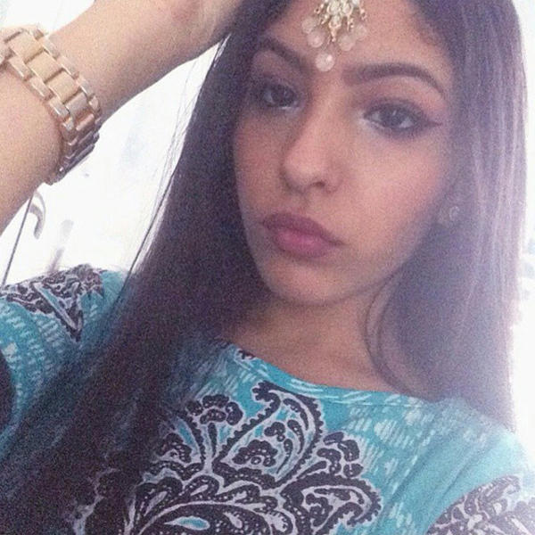
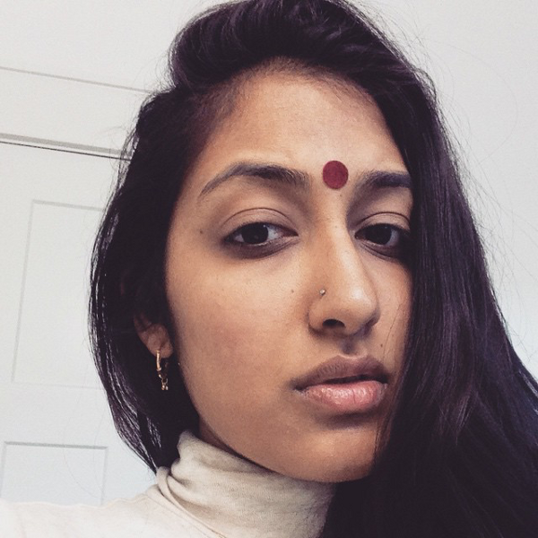
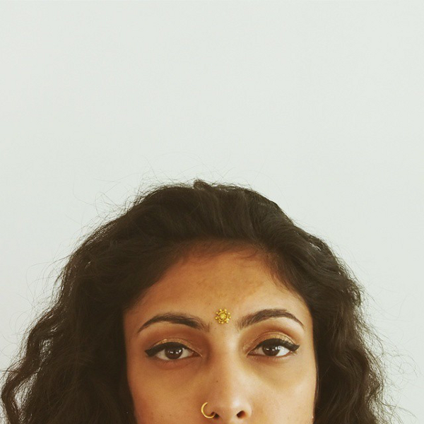
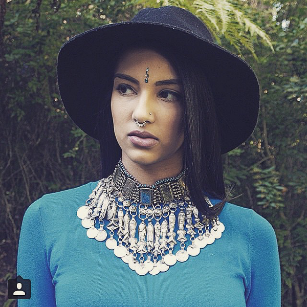

## Herstory of the Bindi

#### #ReclaimTheBindi and the difference between attribution and appropriation

Photo by the [Author](http://vshahphoto.tumblr.com/)

_Bindi, tikka, tilak,_ what do they stand for? To be completely honest, as a high schooler, I hadn&#39;t asked before and really didn&#39;t know. Although I wore it on festival days, and knew of its significance, I was unaware of its precise meaning.

Traditionally worn by married women, the bindi was a red dot applied on the forehead between the eyebrows. It is placed on the sixth chakra, a seat for wisdom and intellect. In _yoga,_ this part of the forehead is often concentrated on. Although modern Indian-Americans may not know the exact significance of the _bindi_, it still holds value in cultural and religious ceremonies.

Yes, the _bindi_ was turned into a fashion accessory by _Desis_ (South Asians) themselves. Ask Indians-Americans what it stands for, its original purpose, and we probably couldn’t tell you. Indian-Americans and _Desis_, however, still practice the core values of their respective cultures and religions, be it Hinduism, Christianity, Jainism, Sikhism, Buddhism or Islam. We respect our elders, our communities and ourselves.

India is a country where self-control is highly respected — there are, of course, anomalies in our society, just as in others. While we may have extended a cultural symbol into a fashion accessory, it still carries a religious root. When we wear bindis, we act and dress accordingly, relating to cultural values of beauty, intellect, self respect, piety and fidelity.

#### Cultural Appropriation &amp; #ReclaimTheBindi

Tweets are flooding in and #ReclaimTheBindi is trending on Tumblr. While some Coachella festival goers are engaging in cultural appropriation of South Asian symbols, _Desis_ are jumping onto the hashtag bandwagon because it’s trending, few of whom actually understand the issue at hand. What exactly is cultural appropriation?
> “Taking intellectual property, traditional knowledge, cultural expressions, or artifacts from someone else’s culture without permission. This can include unauthorized use of another culture’s dance, dress, music, language, folklore, cuisine, traditional medicine, religious symbols, etc. It’s most likely to be harmful when the source community is a minority group that has been oppressed or exploited in other ways or when the object of appropriation is particularly sensitive, e.g. sacred objects.”  
> — [Susan Scafidi, Fordham University Law](http://jezebel.com/5959698/a-much-needed-primer-on-cultural-appropriation)

The _bindi_, along with some other **cultural and religious _symbols_**, like traditional _mehndi_, have been adopted by a class of American youth due to the perpetuation of such symbols in recent pop culture — Selena Gomez, anyone? This wouldn&#39;t be such a large issue if the adopters respected the origins of the symbol and what it stands for.

Coachella is a music festival. Its audience aims to look hip at a festival which glamorizes “Oriental” practices — never mind that Orientalism itself is clouded in xenophobia. But it appears that the only “Oriental” practice it really does promote are fashion accessories.
> _Does the fashion of bindis and mehndi in mainstream culture,  
> promote xiào, the Confucian virtue of filial piety?_> _Does it promote ahimsa, the Hindu/Jain/Buddhist virtue  
> of compassion and non-violence?_> _Does it promote anything culturally South Asian  
> besides fashion accessorizing?_

#### Tackling the Coachella attitude

Coachella is frequented by carefree young adults — many of whom know little to nothing about Indian culture. They are largely unaware of the sentiments associated with Eastern symbols, and are attempting to spread cultural items as trendy accessories minus culture. They aren&#39;t furthering South Asian values, but are instead blatantly negating them by _white-washing_. Nothing about the _bindi_ at Coachella or elsewhere promotes its representation of wisdom or fidelity.

I wouldn&#39;t be so upset by the western adoption of a cultural symbol were it respected and kept within its cultural context. After all, cultures evolve, and the Internet has simply accelerated such globalization. Knowing a few basic things about the culture where the symbol comes from could alleviate much of the discontent.

Respect the fact that the culture is still ingrained in the lives of over a billion South Asians. I’d love it if people would take some time to learn about our traditions. Indians welcome outsiders — visit and people will make you feel like you’re at home, _Atithi devo bhava:_ Guests are like God.

It’s uncool to appropriate a cultural symbol — one from a culture that has been discriminated against historically — and use it as a summer fashion trend. Come up with your own trends, or if you’re genuinely attracted to our culture, go ahead and learn what it’s all about. Go to more than just the tourist locations, and meet its peoples. It is a whole different world. In the US, see if you can attend the festivals we celebrate — both religious and secular. There’s a good chance you&#39;ve interacted with a South Asian before; diaspora are everywhere.

I also recommend you try out the original version of the color run: _Holi_! Across the many regions of India, different festivals are celebrated in different ways. Talk to some people, do a little research, visit a cultural center. Try eastern culture in your life by engaging with it instead of just slapping it onto your unoriginal, exotic outfit._Vishwa is a high school student, photographer and writer who expressed dismay at being ostracized for wearing mehndi. She is too young to have ever heard the slurs, pakidot and dothead but both domains are available._

_Images are sourced from #BindiBabes and #ReclaimTheBindi._

[Write For Us](http://medium.com/get-absurdist/open-call-to-writers-c0c6cf6a7bc3) ~ [Donations](https://cash.me/$absurdist)  
_Absurdist relies on your_ [_support_](https://cash.me/$absurdist) _for its monthly publishing costs ~ $500._
