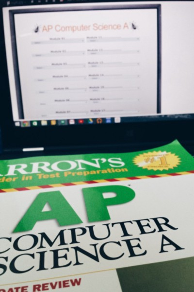

#### Taking 9 classes on Florida Virtual School in 5 years: breaking the experience down.

The option to take extra classes seems to be a blessing until you actually take a class. To be clear, these are middle/high school credit courses that appear on my transcript. Many home-schooled kids take their entire coursework on FLVS, the initialism which many of my peers and I dread.

[Photo by the author](http://vshahphoto.tumblr.com/post/116815649274/time-to-study).

I currently am taking a class on FLVS — AP Computer Science A. Great course; I actually find the content (Java) interesting to learn. I also liked the content of the majority of other classes I took online, with Latin being the outlier.

I’m ambivalent about online classes; they offer students the exposure to courses not offered at their high schools, but also make it ridiculously easy to pass with flying colors. Additionally, it is very difficult to ensure academic honesty.

#### Rigor

While both AP and Honors classes are offered, in addition to some certificate courses, it is very easy to get an A. Students can repeatedly resubmit assignments, and it is very easy to keep resources available during exams or oral quizzes. If not an A, students can most definitely “earn” a B. The real problem with this is that the students can earn high grades without actually learning much of the content. It serves as a GPA booster, reflecting unmastered content on the transcript.

#### Academic Honesty

While there are plenty of programs that could limit a student’s ability to cheat on an online exam, they all come with their own issues. Disallow switching windows? The student can simply opt for another device. Turn on the webcam? A breach of the student’s privacy.

#### The Good

Online classes allow exposure to subjects which may not fit into one’s schedule at school (either because the class is in high demand or isn&#39;t offered.) When a student is inclined to learn the material, online classes can be extremely useful. They also help in home school scenarios, providing a complete curriculum/assignments, allowing students to complete credit courses from home.

They need to figure out a way to make FLVS, and probably other virtual schools, more secure and reflective of a student’s learning. Given the physical absence of the teacher, it becomes very difficult to truly measure the students’ capabilities. However, simply serving courses as easy GPA boosters is not right — cheating and resubmissions make it way too easy to pass without knowledge of content.
