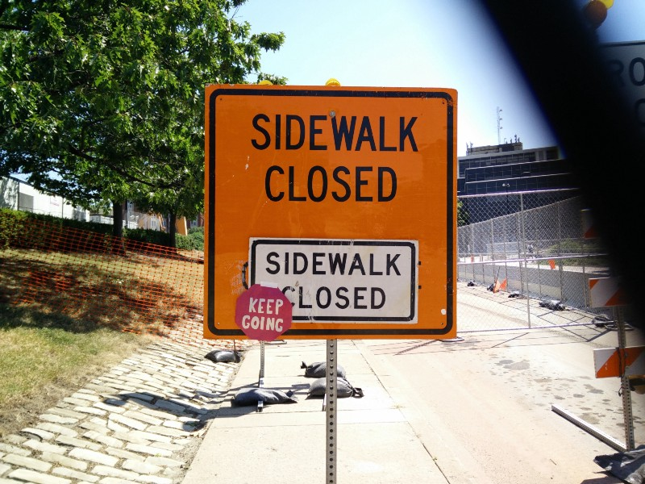

Both a work of art I created in Printmaking class as well as a commentary on my motto for life.

I’m writing this 3 weeks after the end of the program, because I’ve been extremely busy since it ended. And I need to write this for my CAS reflection anyway.

Taking art and design classes was a relatively new experience; I didn’t have this kind of opportunity before, and I never really considered it a priority. I only recently became interested in design, as I discovered it through journalism and making club t-shirts. This program was actually my second choice after SAMS (the math and science program), but if I had to choose now, I would pick Art and Design over SAMS any day. This is not because I prefer art/design over math/science. In fact, I don’t. I still intend to pursue a STEM oriented career, though now I want to infuse it with elements of design. Rather, the art and design program provided me with a unique experience — I got to interact with people who look at the world in a totally different perspective. To them, the computer science kids were the weird ones. My peers and instructors all contributed to my realization that I could actually make art. My lack of experience, prior instruction, and art history background was not as big of an obstacle as I thought it would be.

When I applied to the program and looked at the classes, I thought drawing, painting, and sculpture would be pretty bland. Animation, Photography, and the design classes would be interesting. And printmaking? Well, I didn’t even know what that meant.

I came to Carnegie Mellon and took all 6 classes. Now, I can easily say that aside from the design classes, my favorite were sculpture and printmaking. While I’ve always loved creating, I didn’t realize that translated to art as well. Traditionally, I’ve focused on functional objects. My abilities are far-reaching, and my potential is waiting to be reached.

Perhaps the biggest lesson learned from this program is that I can do anything if I put my mind to it. While I had known that in theory, I had never really felt it from the inside. I worked hard during open studio hours to produce work I was proud of. I think my initial fear of the unknown seriously helped me work hard, and that is the best thing to happen to me to date.

The college experience was great, and it has motivated me to work as hard on my applications as possible; I want to go somewhere that can give me the same kind of motivation to work hard, and an environment that fosters students like those. Friendly instructors, hardworking students, and a resourceful campus combined to form a life-changing experience.
