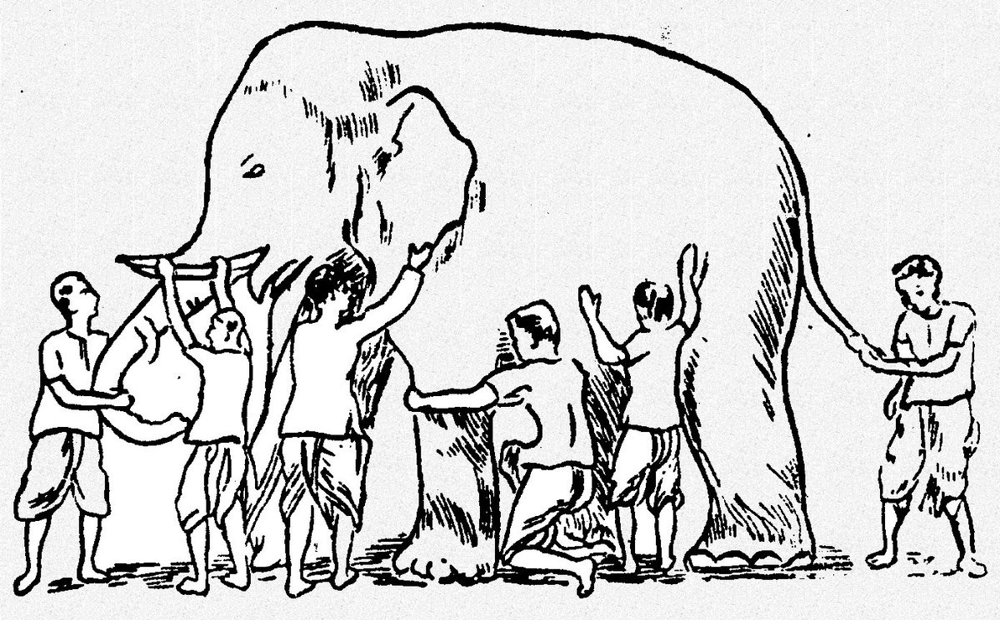
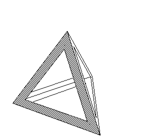

#### Taking the time to understand the “third” core tenet of Jainism

At #YJA18, [Nikita T. Mitchell](https://medium.com/u/ffc8488a2c22) gave a wonderful keynote.
> Your faith is rooted in compassion. Shine that light.

While sharing her story, she asked us to reflect on and share a defining moment for our faith. For me, I thought back to the couple distinctive turning points in how I approached Jainism and where I concentrated my efforts: my journey in **understanding Anekantvad**.

### The Three A’s

If you went to pathshaala as a kid or did some research into Jain theory, you were likely introduced to the three A’s (and their common translations):

*   **Ahimsa** (non-violence)
*   **Aparigraha** (non-possessiveness)
*   **Anekantvad** (non-absolutism, multiplicity of views)

These are regarded as the core tenets of Jainism — what you might say in an elevator pitch when describing this way of life, and the ideal basis for our thoughts, actions, and the evolution of our faith in the modern day.

As a kid, I was given the above translations as definitions. Through examples, non-violence and non-possessiveness were easy enough to convey — explaining our vegetarianism and care for living things as non-violence, referring to material and social relationships as possessiveness. Non-absolutism, however, much less so — how do you exemplify absolutism to a 10 year old? Asking people (scholars, uncles, aunties, you name it) whose first language was not English only exacerbated this dilemma, without anyone realizing the disconnect they were fostering. For the most part, the alternate translations I got were tolerance, or at most, open-mindedness.

### Absolutism outside the scope of Jainism

It took me until middle school government class to extrapolate what an absolutist government (one given unlimited central authority) was to begin to understand absolutism, and eventually 11th grade Theory of Knowledge to encourage my analysis of the implications of that philosophy on our thought process and outlook.

Discussing absolutism versus relativism, the related paradoxes, and the impact of adopting either philosophy on culture and how people approach subjects strengthened my parallel understanding of the concept in Jainism. It further raised my confidence that Jainism was even more of a way of life than a religion; it began to influence how I talked to people, and more importantly how I listened to them. It led a mentality shift of not just respecting contradictory views: rather, I sought to invest myself in their context, to truly understand how people perceived their realities. Less arguments, better compromises, stronger negotiations, and a slightly cooler temperament followed. I’m still a long way from being “ideal”, but I’m definitely in a better position than I was before.

Through numerous conversations with my parents, friends, and knowledgable Jains, I’ve gained an greater awareness as to what Anekantvad entails.

*   Existence of parallel, perhaps _seemingly_ contradictory truths
*   Existence of partial truths
*   Pluralism
*   The significance of context to any statement

### Anekantvad: implications

Here’s _my_ definition of Anekantvad—
> Anekantvad means that people can hold different, even seemingly contradictory views, and both still be right in their own frame of reference.

This has some far-reaching implications. Existence of parallel and partial truths allow people to “disagree”, yet understand of each other’s views. The phrase “agree to disagree” somewhat reflects this sentiment. This is where the context dependency comes in; understanding the circumstances of a statement are what give it partiality. I’d like to emphasize here that agreeing to disagree with an “opposing” position does not imply tolerance, but rather an understanding (or almost an appreciation of) a difference.

I don’t think Anekantvad necessarily implies that everything is _right_; rather, truth is likely abstract, and very context dependent. This fits in with the idea that intentions take precedence on actions in karmic philosophy.

Everything written in our scriptures was said with some intention — some _bhav_ — in the past. Some of those things may be evolving now, and while the underlying truth remains, it may be represented differently in today’s world. An example of this would be the dairy industry now — while milk was encouraged in the past, we’ve noted as a community that it may no longer align as closely with our core value of _Ahimsa_ (non-violence)_._ As a result, many Jains (and non-Jains alike) are moving towards veganism.

A [common illustration](https://www.jainworld.com/literature/story25.htm) of Anekantvad: imagine 6 blind people all interacting with different parts of an elephant. Not knowing what it is, they might all guess they’re touching various objects depending on what part of the elephant they sense. None of them are objectively wrong, per se, but are only in a position to view a partial truth.

Perhaps the truth is whatever encourages spiritual progress. Perhaps it’s what makes the most sense given a context. Perhaps it is what is best for that _jiv_ (soul). And maybe, it’s all of these and **more**. After all, if it’s what’s best for the _jiv_, then it’s up to that _jiv_ to decide what to believe in that sets themselves up for success.

From my experience talking to people, from Jain scholars to fellow peers at YJA, I’ve often noticed Anekantvad marginalized. It may take a little more effort to understand and internalize, but from my experience incorporating it into my thought process, it has made a massive impact. Not only have I become a better person and more holistic communicator, but also a better problem solver at large — something crucial for my profession as a software engineer. It’s a marketable skill, if you do it right. And foremost, **it has made me happier.**
> **Life’s all about finding the right angle, and thinking about the world with a multiplicity of views lets you find the right view for the occasion.**

If you ever just want to talk about Anekantvad and/or Jainism, feel free to hit me up! I’m always up for a good conversation.

Quick movie recommendation: [**Arrival**](https://www.imdb.com/title/tt2543164/). If you’ve already seen it and don’t realize why I’m recommending it, shoot me a [message](http://m.me/vishifishy) :)
