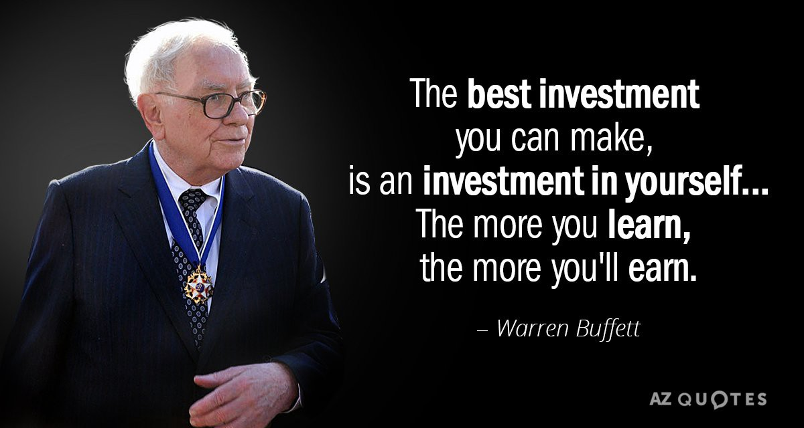
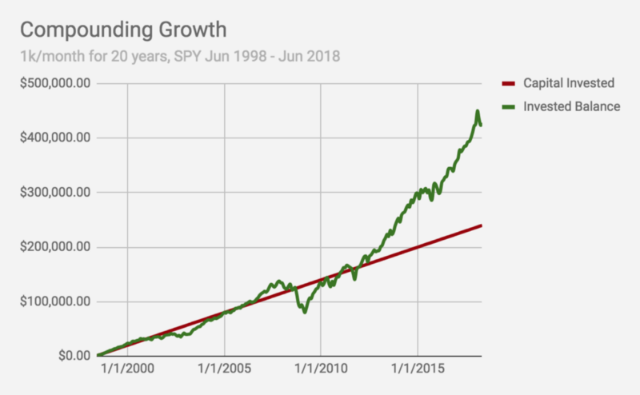

#### growing that internship money

You’ve been watching those direct deposits come in — maybe spending lots of it on rent, recreation, and the likes. Maybe tuition or housing this Fall. If you have the bandwidth to save some of it, however, your bank balance has been rising. How do you make the most of it? **Invest.**

### What Does It Mean to Invest?

According to [investopedia.com](http://investopedia.com) (a great resource!):
> Investing is the act of committing money or [capital](https://www.investopedia.com/terms/c/capital.asp) to an endeavor (a business, project, real estate, etc.), with the expectation of obtaining an additional income or [profit](https://www.investopedia.com/terms/p/profit.asp).

#### Investing vs Trading

Investors are in this for the long game. A diversified portfolio (with stocks, bonds, and/or ETFs) is typically expected to ride out market swings and anomalies. Investors also typically rely on compounding and reinvest those gains into stocks and bonds as well.

Traders (of which there are a few types, like day traders and swing traders), typically live by the motto of “buy low, sell high” (or the reverse, which is known as “shorting” a stock). They seek to materialize profits in the short term, typically with the goal of beating the market average, thus gaining higher profit than investors.

#### Which one is right for you?

As a beginner, you’ll likely want to invest most of the money you’ve decided you’d like to see grow (as opposed to rely on your amateur trading skills). If you’re interested in getting into trading, I’d recommend starting out with a relatively small amount and slowly get into the game.

### Understanding Investment Approaches

As you’d imagine, there are several strategies you (or funds you invest in) can take with investing: it’s a big world to navigate. Typically, approaches are divided first into two categories: active and passive.

#### Active

As it sounds, an active approach means that someone is making regular decisions about which stocks and bonds you own. A common example is mutual funds, where fund managers are the decision makers. You can also be your own manager, doing research and choosing stocks and bonds that fit in with your strategy. These investors also typically take advantage of shorter term fluctuations, and utilize more robust metrics.

#### Passive

Passive approaches require much less effort on the research side from the investor, and fund managers don’t play a role here: these funds are typically invested in a set of stocks/bonds that meet a certain criteria. Index funds are great example, helping your money grow with the market average. **NYSE:SPY** is a popular index fund tracking the S&amp;P 500 — it invests in the top 500 publicly traded companies in the US (by market cap).

### Growth vs Value Investing

Any investors goal is to maximize returns from their holdings. The difference here is where one identifies the source of profit: growth vs value.

#### Growth

Typically associated with more risk, growth stocks are identified by their momentum, with a higher P/E ratio — these are expected to grow in earnings at a pace faster than the average market. Smaller companies and emerging markets are often major candidates for growth investors. [**T. Rowe Price**](https://www3.troweprice.com/usis/corporate/en/what-we-do/investing-approach.html) is a famous growth investor.

#### **Value**

Value investors identify stocks which are priced less than where they should be, essentially buying them at a “sale” price. They believe that stocks are often under/over-valued based on external factors, like panicking investors or not enough product success yet. The focus is on the value of the company and what it really has to offer, with the idea that the price will increase on the sole basis that the company offers significant value. [**Warren Buffet**](https://www.investopedia.com/investing/warren-buffetts-investing-style-reviewed/) is a value investor.

You definitely don’t have to pick between these two, and can and should diversify your strategies. Growth and Value investing approaches can also be combined — a well known method combining the two was publicized by **Peter Lynch**: Growth At a Reasonable Price ([**GARP**](https://www.investopedia.com/university/stockpicking/stockpicking5.asp)).

### The Power of Compounding

If you’re hesitant about putting the effort into getting started investing, here’s one more reason: compound growth. 5–10% might sound small to you, but with compounding the effects are massive.

Most people have trouble visualizing what compounding really means. Let’s start off small — say you invested $1,000 every month into NYSE:SPY since June 1998. That’s $240,000 in raw capital invested by June 2018.

With the performance of SPY, your money would’ve grown to $439,324.36 by the end of June 2018 — almost doubling it. That being said, one can’t every guarantee returns; investing inherently carries risk to some extent. In the above graph, for example, investing in SPY was netting negative in 2008.

### I’m Ready to Invest!

Not sure where to start with your money? Check out Investopedia’s guide on [picking your first broker](https://www.investopedia.com/articles/younginvestors/06/firstbroker.asp).
> [**Robinhood**](https://robinhood.com/) is also a great, easy to use platform. If you decide to try it out, sign up with my referral link ([http://share.robinhood.com/vishwas17](http://share.robinhood.com/vishwas17)) and you’ll get a free stock (as will I, for full disclosure).
