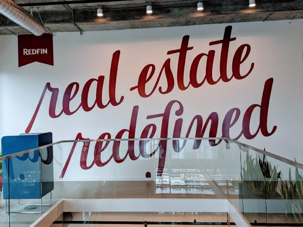
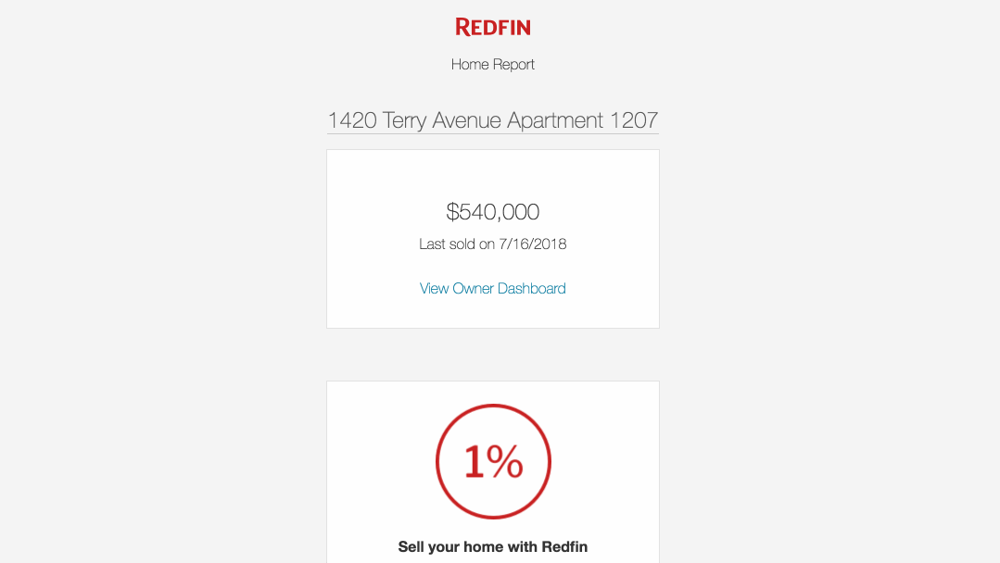
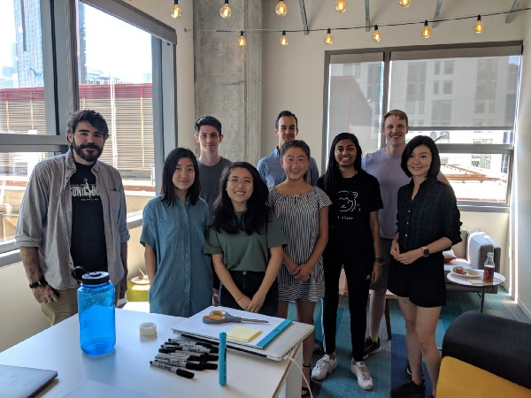
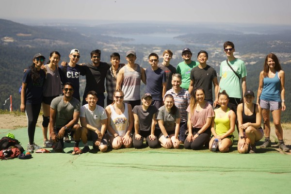

#### Engaging homeowners without _really_ knowing what it’s like to be one

Nine months ago, I got on a call with my future manager to talk about the scope of the team and understand if it’d be a good fit. **Owner Engagement** focuses on making Redfin resourceful for homeowners in an effort to retain their interest and ultimately convert owners to sellers.

Having in the past worked on engineering infrastructure, I was excited to diversify and work on the product side of a company — I wanted the fulfillment of knowing users were directly impacted by my work. Working on product development at Redfin, however, presented a new challenge: _understanding_ the product. As a 20-year-old college student who has never been through the home-owning or searching process, I had quite a bit of catching up to do with real estate.

As my start date for the summer approached, my manager reached out to me to get an idea of what I’d be interested in working on. Frankly, I still had a relatively limited idea of what my team _actually_ did despite our previous conversation; I had a limited understanding of the company’s organization as a whole. Data science and machine learning were fresh on my list of technically interesting topics, and I also enjoyed working on the backend. Fortunately, my full-stack team gave me opportunities to try a variety of technical areas, with room for cross-team collaboration, A/B experiments, and feature brainstorming. Based on my interests, my manager and mentor proposed an interesting, open-ended task: investigating and optimizing the open rate for **Redfin’s Home Report**, a monthly email we send out to homeowners with notable information about their home and neighborhood activity.

The Redfin Home Report, a monthly email sent to homeowners containing highlights of home and neighborhood activity, including the Redfin Estimate and recent listings.

I spent the first 6–8 weeks of my internship working on several well-scoped tasks — some frontend, some backend. This allowed me to gain a **broader, more real Redfin engineering experience,** as opposed to being sent to my own “intern island” with an isolated project. I **** found some bugs, added a feature, covered edge cases, and worked with a number of other devs and PMs at Redfin. In those first few weeks, I learned a lot about real estate: industry terms, its seasonality, etc. I also saw how operating in the real estate space impacted our technical design, at times presenting unique challenges. One of the edge cases I dealt with, for example, was a caching situation specific to when off-market homes went up for sale.

As I wrapped up these smaller tasks, my focus began to shift forward to the larger project at hand. In investigating and proposing solutions to optimize home report opens, I found myself asking my team many more questions about how homeowner interests lined up. I often faced challenges in decoding the implications of patterns, also suspecting that I wasn’t thinking of potential influencing factors because I was unaware of their importance.

My solution to this was two-fold: I continued to garner input from the primary stakeholders in this project (Owner Engagement, Analytics Engineering, Email Marketing, Notifications) while also trying out some clustering algorithms on my data. I ended up not getting much insight out of the clustering, reinforcing the importance of domain knowledge ([no free lunch](https://en.wikipedia.org/wiki/No_free_lunch_theorem)!). I did go on to incorporate the insight I gained from conversation to inform my decision to try running some classifiers, which did significantly better.

(Most of) Owner Engagement!

Fortunately, Redfin has a very **collaborative, open culture** — extremely conducive to learning and growth. My team members, as well as others whom I pinged or wandered into their office asking questions, were always incredibly receptive to both my curiosity and confusion. I learned a lot about homeowners, but more notably, I gained some product experience, investigated a number of trends, and designed and implemented 2 experiments. I was also able to have a concrete impact on my team’s primary metric, find and resolve 3–4 technically interesting bugs and inconsistencies, and **grow as an engineer, communicator, and team member**. Results from my experiments are still pending, but as I leave I’m excited to have been able to have an impact at Redfin.

Interns and Glenn at Poo Poo Point!

I’ve had a summer full of learning and fun: this internship experience has challenged me to improve a wide variety of my skills: code quality, technical design, experiment design, cross-team communication, debugging, test coverage, domain knowledge, and spec/documentation. Shoutout to [Dan Ehrman](https://medium.com/u/b183da8938c5) (manager), [John Chillemi](https://medium.com/u/146d1d9c8e09) (mentor), and [Stephanie Ha](https://medium.com/u/54b9e6f72c6b) (recruiter) for making this summer an incredible experience. From hiking with our friendly and insightful CEO [glennkelman](https://medium.com/u/4764cf601fba) to resolving timezone discrepancies, it has been a pleasure. Thanks, [Redfin](https://medium.com/u/57276feb4464)!
