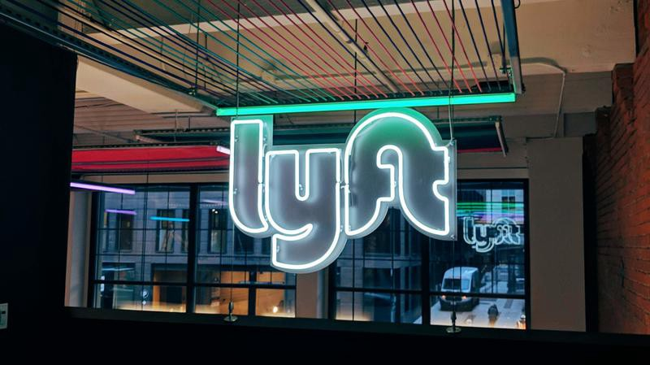

#### Last August I realized I would graduate in May — earlier than expected. I wasn’t mentally prepared; I didn’t know what I wanted to pursue career-wise. So I figured, another internship?

I learned a ton this winter while at Lyft. My work was primarily related to data pipelines, and with the mentorship from Dan Fan and Ikramul Haq (and great feedback culture!) I strengthened my ability to evaluate technical design decisions, communicate across teams, and build solid services.

More broadly, I talked to several people about their career trajectories, which ranged from “I started coding at 14” to “I took a 2 year break after a few years in X and then got into tech.”

I came to terms with the idea that I’m probably never going to know if I want to do something for the rest of my life, at least starting out. I aspire to be impactful in the environment I’m in, and as my experiences continue to inform my decisions moving forward, I imagine that environment might evolve to something else. (or not?)

While I may only have slightly more clarity than I did in August, I’m now excited to graduate, and for the self and global discovery to continue.

Thanks to Dan and Courtney for encouraging me to reach out to people, and to those who shared their stories — this winter or before.

—

[Originally posted on LinkedIn, cross-posted here for posterity.](https://www.linkedin.com/feed/update/urn:li:activity:6541005137249394688)
