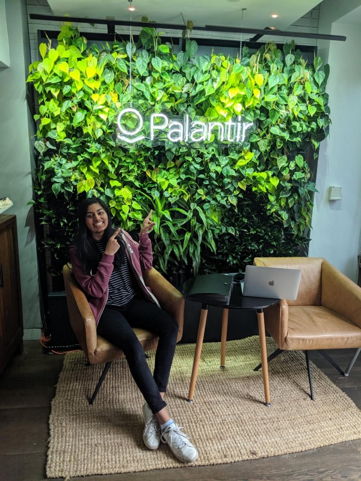

This summer was filled with unknowns.

London, a city I knew no one in, on a continent in which I’d never left an airport. [Palantir](https://medium.com/u/1529195d9f13), where I’d intern as a forward deployed software engineer — I knew it’d be something different, but not exactly how.

These unknowns led to quite a bit of discovery. I was able to reflect on my place in the world and interface with people of all kinds of backgrounds and attitudes on life, careers, and politics. I became a better conversationalist and a more aware individual.

At Palantir, I explored aspects of my skillset I hadn’t before exercised so strongly in a work environment. I was able to layer my technical skills with my ability to synthesize, design and present solutions. I approached broader problems, worked across teams to understand and deploy necessary software, and felt a larger sense of ownership, responsibility, and impact.

Above all, I loved working with the people and felt empowered to make decisions. Major thanks to [Steve Basher](https://www.linkedin.com/in/ACoAABdN0zYBLCpfEzQseDXOlm1UhGE32JfJQ5w/), [Chloe Lathe](https://www.linkedin.com/in/ACoAACW5IrMBjUfExp-wGfhFX-P2r8vWbqP4j9c/), and [Kristine Snyder](https://www.linkedin.com/in/ACoAAAkFW9sBQV8qfakDF66THPQRlcHfXFU0QNo/) for helping me be successful this summer, and the numerous others with whom I worked with for making me feel welcome. 🙂

—

[Originally posted on LinkedIn, cross-posted for posterity.](https://www.linkedin.com/posts/vishwa35_london-intern-careers-activity-6571810421563543554-9pI1)
