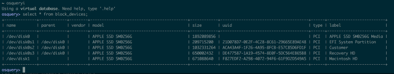

> Heads up, we’ve moved! If you’d like to continue keeping up with the latest technical content from Square please visit us at our new home [https://developer.squareup.com/blog](https://developer.squareup.com/blog)

### What is [osquery](https://stackedit.io/osquery.io)?

osquery is an an open source tool by Facebook that provides a SQL interface for system information.

Over the course of the summer I’ve been working on integrating osquery results into our internal asset tracker for automation/validation purposes. It’s been incredibly useful for monitoring various stats, and the SQL interface makes it easy to use.

### Finding the miscalculations

#### small linux disk sizes?

I’d been collecting data for about 2 weeks, when I changed the UI to showing human-readable numbers, and noticed the total disk size for a host was 0.58 GB (585871964 bytes). It seemed illogical to have a disk that small, so I looked up the actual disk size using `sudo fdisk -l` on that host, and it was 300 GB (299966445568 bytes.)

It turns out `585871964 * 512 = 299966445568` yields the correct size. But what is 512, anyway?

#### What is [block size](https://en.wikipedia.org/wiki/Block_%28data_storage%29)?

The basic data primitive in computing storage is the byte– however, many storage devices perform I/O operations in larger units (the block size) for efficiency reasons. It’s historically 512 bytes (but it can differ) because of the physical notion of a sector on a disk.

Turns out, despite the documentation stating this was returning in bytes, it was actually returning by block size; in this case 512.   
I hard coded it into my code and decided to submit a patch to osquery to fix the issue and also add a column to the `block_devices` table for device `block_size`.

### rip more bugs

When I went to fix the Linux implementation and add the column, I saw that there was also a Darwin implementation. Curious to see if the issue was persistent, I ran it on my mac, and found that it was also inaccurate. I have a 256GB model.

osqueryi results on my mac

My SSD is 1892089856 bytes? Or `1892089856 * 512 = 968750006272`? (I wish I had almost a terabyte). Psych, it’s gotta be something else!   
Took a look at the Darwin implementation, and found that it was using a bunch of IOKit stuff I had no idea about. I asked around for help, and we eventually found the Apple open source header for the method we needed to dissect. (I learned in C you can have [opaque structs with hidden definitions](https://en.wikipedia.org/wiki/Opaque_pointer))

### opaque structs are no fun

It was difficult to figure out what it was doing at the system level, but the documentation pointed me to a dictionary `CFMutableDictionaryRef` that contained something for the key `Size`. Found some code on StackOverflow to print this dictionary, and turns out it was indeed returning the correct number. That’s when I became suspicious of a truncation error.

Running `diskutil info -all` locally I found that I had   
`Disk Size: 251.0 GB (251000193024 Bytes) (exactly 490234752 512-Byte-Units)`

The first dictionary printed, which would be `/dev/disk0`. The line with size:
``17 : &lt;CFString 0x7fffeb91cd20 [0x7fffeb978da0]&gt;{contents = &#34;Size&#34;} = &lt;CFNumber 0x3a70c7000037 [0x7fffeb978da0]&gt;{**value** = +251000193024, **type** = kCFNumberSInt64Type}``

Immediately noticed the `type = kCFNumberSInt64Type`.

### houston, we have a truncation error

Converted it to a 32 bit int in ruby, and it confirmed that was the issue.
``2.4.1 :001 &gt; x = 251000193024  
 =&gt; 251000193024  
2.4.1 :002 &gt; x &amp; 0xffffffff  
 =&gt; 1892089856``

I saw that there were checks for what type of `CFNumber` it was, but for some reason it wasn’t getting caught. Apparently it was hard coded it as a `kCFNumberIntType` somewhere in a series of nested method calls. I changed it to actually use the `CFNumberType` of the number.

After fixing the Darwin implementation, I decided to return that in block sizes as well, to maintain consistency with the Linux implementation. Made this choice because Linux was already providing in block size, while the Darwin implementation was meaningless. Added the `block_size` column to both tables.

See the [PR](https://github.com/facebook/osquery/pull/3539) / [Issue](https://github.com/facebook/osquery/issues/3538) on GitHub

### tl;dr

*   Be attentive to truncation errors when handling ints
*   Making programmers track types and silently converting often leads to type conversion errors

#### Thanks to [Evan](https://github.com/eam), [Michael](https://twitter.com/mtauraso), and [Ken](https://twitter.com/kwiggint) for all the help :)
