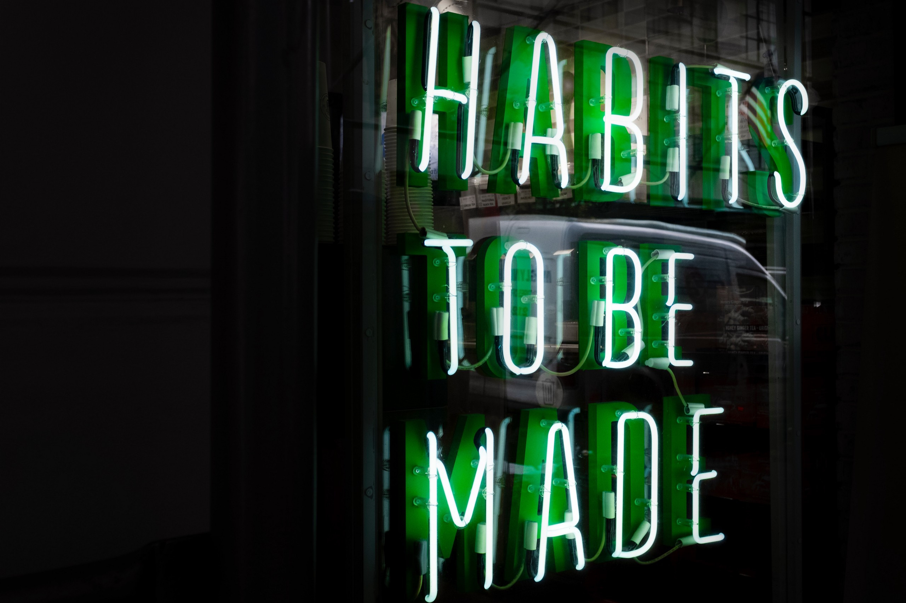
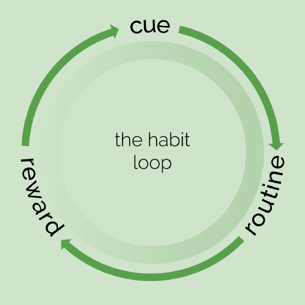
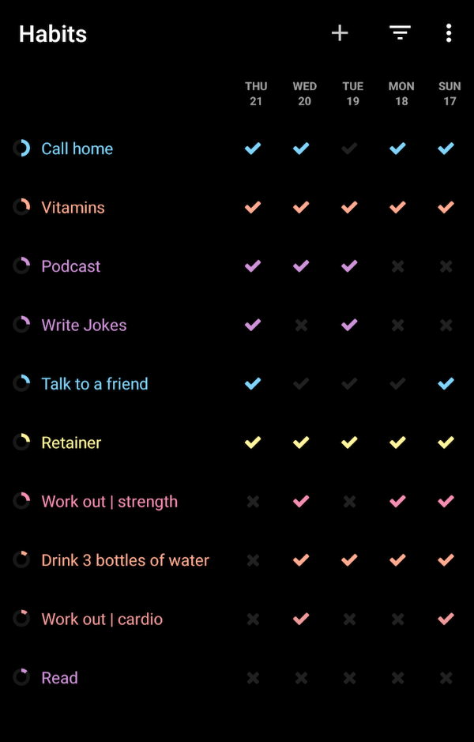

#### How to actually accomplish your New Year’s resolutions and keep the cycle of self-improvement churning.

Every morning as I leave for work, I grab my keys off the same place on the counter, stuff my feet into my boots, and lock the door.

Then I walk down two flights of stairs, and ask myself — did I lock the door?

For the first 3 weeks or so, I’d go back up and check. Soon after, I’d reassure myself it was locked — it always was.Habits are an interesting phenomenon. A few years ago, my dad recommended I read [The Power of Habit](https://www.goodreads.com/book/show/12609433-the-power-of-habit). As a high schooler, I didn’t heed much to such recommendations, but now with some more free time, a refined sense of reflection, and an acute desire to become “wiser”, I decided I wanted to start reading again.
> Habits are an interesting phenomenon.

For a while now, I’d been trying to reintegrate a number of habits into my life, mostly unsuccessfully. I had a tendency to start something, do it for a few days (a couple weeks, if the timing was good), and then forget about it. This book helped me understand how habits worked so I could leverage them effectively and stop flaking on myself.### Theoretical Learnings

Before diving into the resources and tooling I used to hold myself accountable and track progress, I’ll go into the underlying concepts that helped me decide _how_ to tackle my lack of consistency.

#### Habits are neurological circuits

When routines register as habits, they’re basically hardwired into your brain.

There’s a **cue**: this tells your brain to enter a specific circuit. Then, your brain stops actively making decisions and falls into autopilot. That’s the **routine**. And when it completes the circuit, a light bulb is supposed to go on at the end — the **reward**.

This system reflects the simplest of habits: I pick up my keys (cue), wear my shoes and lock the door (routine), and I gain the peace of knowing my belongings are secured (reward).

Autopilot doesn’t work while the habit is stil l forming. Eventually, I stopped even questioning whether or not I locked the door — I knew I did. Until then, however, my brain was still adjusting to the cue and verifying the routine was actually performed to ensure the reward was acquired.

#### Building the circuit

The **routine** is usually easy to identify; it’s the habit you’re building — the goal. Every habit has a **cue**, or trigger; that’s what reminds your brain it’s time to find the appropriate circuit. Typically the most difficult to identify, however, is the **reward**; sometimes it’s immaterial (an rush of emotion, even) and harder to pinpoint. Without figuring it out, though, habits can be difficult to construct.

There’s no strict formula you can follow to know a habit will form. Depending on the complexity of the habit, it can take anywhere from a couple weeks to months (or more) to form. The great thing about habits, however, is that once they’re formed, they will work as long as the cycle stays intact.

To break a habit — which can be equally important to one’s life — you must override the circuit. It usually won’t disappear on it’s own (you’d need to disguise or destroy the cue, otherwise). Rather, by taking the same cue and reward and building a new circuit that operates within those bounds, you can replace a bad habit with something much better.

For example, if you wake up and crave a cigarette for that rush of nicotine you get, you could replace it with something else you do every morning that also makes you feel good. Working out? Making a smoothie? To each their own.

Clearly quitting smoking isn’t just that easy, but if one can hack their habits intelligently, they just might be more likely to succeed. (Addiction is something a bit more than just a habit, but many smokers also smoke partially out of habit.)

#### Habits can make or break your life

Let’s start by thinking about two core drivers of health: diet and exercise. Both can be governed largely by habits.

Take, for example, someone who walks or bikes to work daily. They are bound to build some cardio endurance by nature of their routine. On the other hand, someone who always eats dessert after dinner will naturally consume a significant amount of sugar. What if they are found to be diabetic? A much harder situation to tackle.

These are seemingly minor examples, but stacked up with the other similar choices we make that play out into habits, they can have compounding and long-lasting effects.

Perhaps understanding how these play out 10, 15, 30 years into the future can motivate you to change now — because changing later? That’s even harder.

### Practical Changes

Given some of my learnings, I restructured my approach to hack habit formation and make giving up inexcusable.

I needed approachable goals, a stronger sense of accountability, and defined cues/rewards.

#### Habit Tracking: [Loop](https://play.google.com/store/apps/details?id=org.isoron.uhabits)

Foremost, I needed somewhere to track progress. Without that, I wouldn’t know if any of my efforts were actually working.

[Loop — Habit Tracker](https://play.google.com/store/apps/details?id=org.isoron.uhabits)

Fortunately, I found Loop, a habit tracking app for Android. (There is no iOS equivalent to my knowledge, but there are a ton of similar apps out there to try out!) I was able to input a bunch of things I knew I wanted to focus on — some that were new to my routine, some I did on and off (like wearing my retainer…sorry mom).

For each habit, I could put how frequently I wanted to do it (x times per week) and when/if I wanted to be reminded. The notifications served a dual purpose for me sometimes: they ensured I logged the habit, and sometimes served as a cue.

Having an app to track progress ultimately became more than just a measuring tool; for calling home, for example, if I hadn’t already done it on my commutes (the usual cue), I’d call when I got the reminder. The reminder became _the_ cue for wearing my retainer. For others, like reading, working out, or calling a friend, the reminders merely served as reminders if I was falling behind.

#### [r/DecidingToBeBetter](https://www.reddit.com/r/DecidingToBeBetter/)

While the app gave me a way to track my goals, I discovered I still needed something to push me to consistently evaluate my progress.

[r/DecidingToBeBetter](https://www.reddit.com/r/DecidingToBeBetter/) is a subreddit that helped me with the accountability. There are monthly posts to define goals, and then check if I accomplished them at the end of the month.

I’d lay out habit formation as goals: for the month of January, my goal was to work out 5 days a week. I tracked that in Loop, and then evaluated it at the end of the month. If I didn’t feel like it was an necessary part of my routine yet, I’d carry over the goal to February to continue building on it.

I found that this practice, whether you do it through reddit, a supportive accountability buddy, or in a notebook, is integral to the conscious act of habit formation. Consistency is key to habit formation, and you need to have some way of checking if your milestones are being met.

#### [Google Calendar](https://calendar.google.com/calendar/r)

This one’s a bit more mundane, but nevertheless helpful. Since cues are so important to the habit loop, I looked at my typical routine and defined what my cues could be for a number of habits. I’d put them into my calendar to remind myself not only to do the routine, but the establish the routine as a result of some cue.

I found this helpful to ensure I established a cue-routine relationship. This would help my brain establish the cue-reward relationship in the longer run.Regardless of all the tooling you have, **nothing will work without willpower**. For me, realizing that habits having a propensity to govern my life is a large driver. I saw how some of my better habits had already set me up for success, and I wanted to replicate that in other facets of my life.

### Struggles, and how to tackle them

After some success with my new methods, I dissected how this year differed from the other times I had tried to build changes into my life.

#### Instant Gratification

My previous attempts to build positive habits depended on a large burst of will that eventually tapered out because I didn’t see immediate results. Setting smaller goals and tracking their progress helped combat that approach. Instead of thinking I wanted to suddenly live a healthy lifestyle, I structured my goals with the **SMART framework** — specific, measurable, attainable, relevant/results-oriented, and time-boxed.

For example, in January:

*   eat food I cook at least 4/5 weekdays
*   go to the gym at least 5 days a week
*   eat vitamins every day

Since I was trying to build habits, however, if I didn’t feel these were automatic by the end of the month, I’d carry them over to the next month.

#### Overload

To combat the overwhelming feeling of trying to accomplish too much, I decided to focus only on a few, related things every month this year. I would center my goals on a specific aspect of my life: physical health, mental health, relationships, organization, etc. That way, I was working towards a holistic goal in addition to the concrete milestones I needed to achieve.

Once I solidified those habits, I could move on.I highly recommend reading Charles Duhigg’s [The Power of Habit](https://www.goodreads.com/book/show/12609433-the-power-of-habit). It has so much more than the habit loop — from how habits can be used to hack our lifestyles to organizations and societies.

Duhigg references some incredible leaders, corporations, and comeback stories demonstrating the true power of habit. I feel better equipped to understand how to accomplish my goals as an individual and transform teams as a leader.
